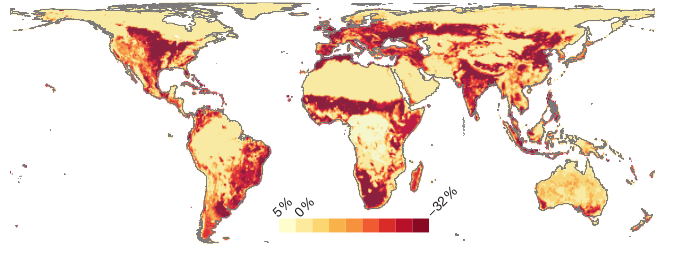
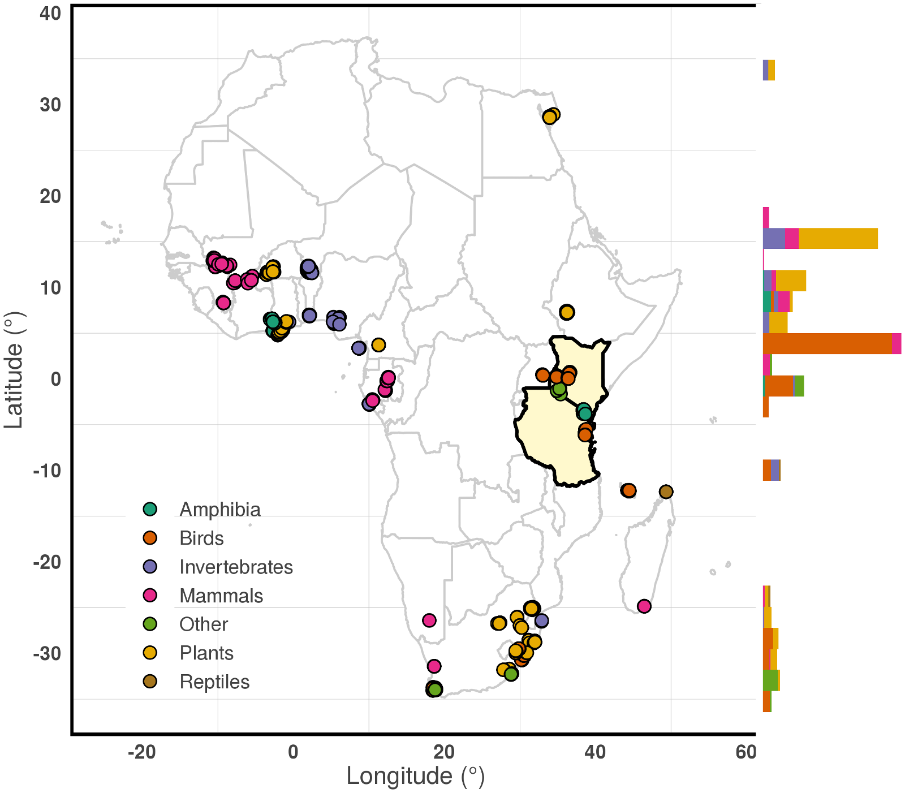
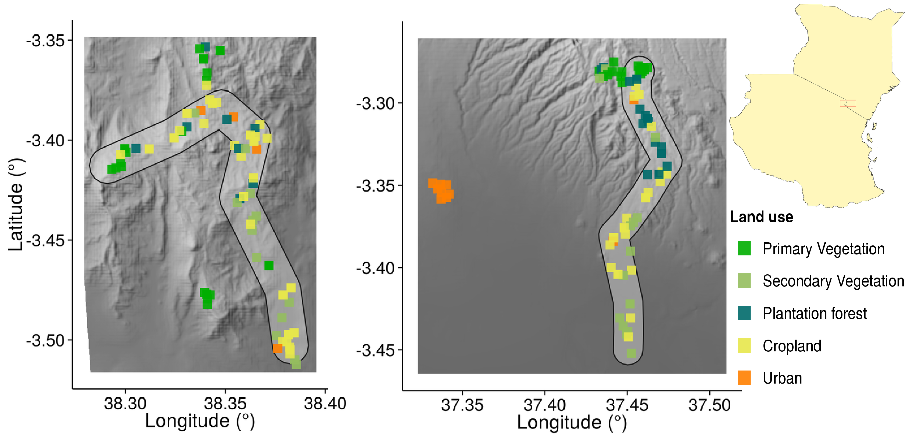
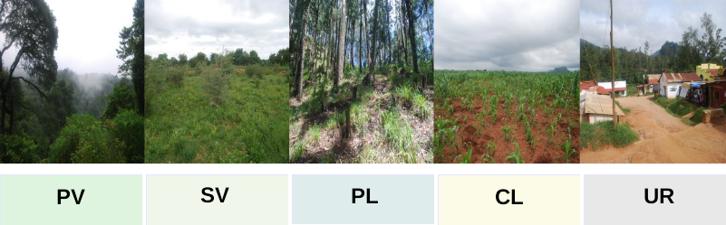
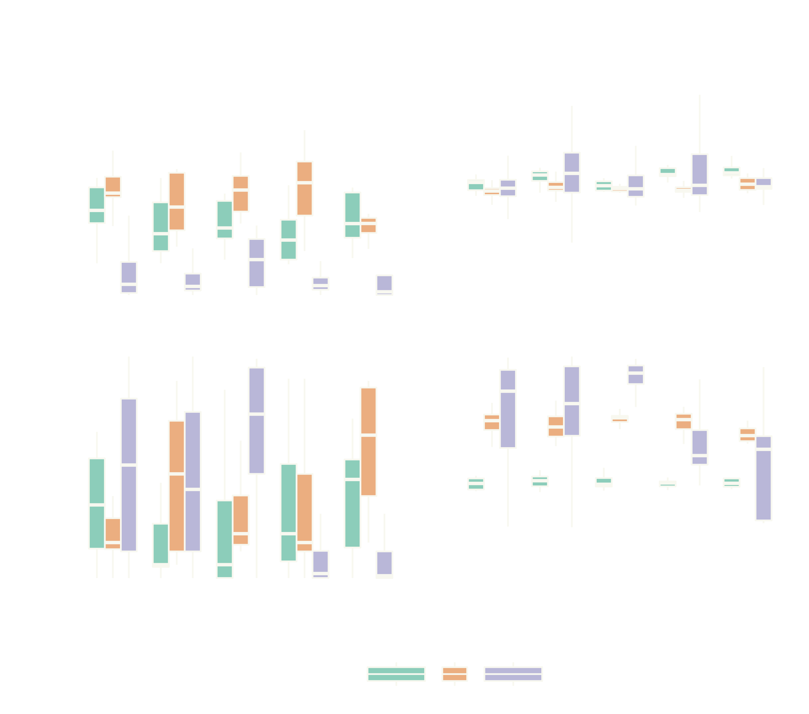
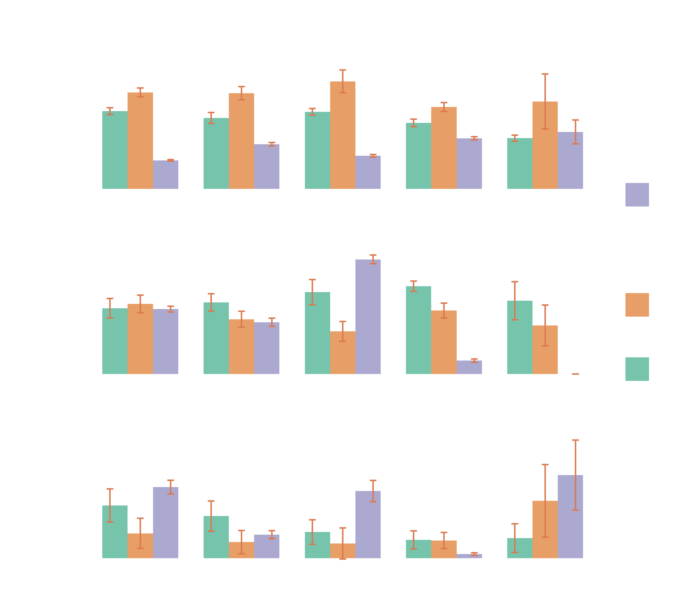
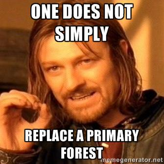

## Biodiversity models

Predicted change in species richnes from Newbold et al. (2015)
 <!-- .element: style="font-size:12px;" -->

Note:
- Response of biodiversity to anthropogenic pressures
- Global application, multiple species groups, spatial explicit
- Models for biodiversity policies

---

<!-- .slide: data-background="#F9F9F9" -->

## Potential Problems

- Many broad-scale models generalize over a wide range of variables <!-- .element: class="fragment fade-in current-visible" data-fragment-index="1" -->
- Often only single factor ( land use ) models <!-- .element: class="fragment fade-in current-visible" data-fragment-index="2" -->
- Based on available ( biased ? ) data <!-- .element: class="fragment fade-in" data-fragment-index="3" -->

------
<!-- .slide: data-transition="fade-in slide-out" data-background="#F9F9F9" -->

# Question :

How well does an African-wide model reflect species diversity and abundance on a local land-use gradient where local conditions are known? <!-- .element: class="fragment" data-fragment-index="1" style="text-align:left;font-size:48px;" -->

------

# Methods

---

 <!-- .slide: class="smt"-->

---
<!-- .slide: class="smt"-->

---

<!-- .slide: class="stretch" data-background-video="media/Speckled_Mousebird.m4v" data-background-video-loop-->

- Timed point counts <!-- .element: class="fragment fade-in" data-fragment-index="1" -->
- Total 147 sites: 172 species, 2700 individual counts <!-- .element: class="fragment fade-in" data-fragment-index="2" -->

---

<!-- .slide: data-transition="fade-in slide-out" data-background="#DFDEE3" -->

## Auxiliary data for the comparison

- Remote-sensing and census data (iNDVI and meanNDVI, HuPoDen, Forest-Cover y2000 ) <!-- .element: class="fragment" data-fragment-index="1" -->
- Functional traits (Range size, Threat status, Forest specialization  ) <!-- .element: class="fragment" data-fragment-index="2" -->

------

<!-- .slide: data-transition="slide-in none-out" -->

# Results

---
<!-- .slide: class="smt" data-background="img/zwartevilt.png" data-background-repeat="repeat" data-transition="none"-->

---
<!-- .slide: class="smt" data-background="img/zwartevilt.png" data-background-repeat="repeat" data-transition="none"-->

---
<!-- .slide: class="smt" data-background="img/zwartevilt.png" data-background-repeat="repeat" data-transition="none"-->

------

# Summary
<!-- .slide: data-background="#00000"-->

- Cropland higher number of species than the average more intense cropland site (Agroforestry) <!-- .element: class="fragment fade-in current-visible" data-fragment-index="1" -->
- More forest-specialists in cropland <!-- .element: class="fragment fade-in current-visible" data-fragment-index="1" -->
- Primary forest likely lower diversity due to size and fragmentation <!-- .element: class="fragment fade-in current-visible" data-fragment-index="1" -->
- Uncertainty in urban habitats <!-- .element: class="fragment fade-in current-visible" data-fragment-index="1" -->

------

# Acknowledgements
- Tim Newbold and Neil Burgess for scientific advice
- PREDICTS contributors for making data available (http://predicts.org.uk)
- The CHIESA project partners for support and coordination
- Everyone at CMEC and UNEP-WCMC
- Danida Fellowship Centre for financial support

------

<!-- .slide: data-background="white" data-transition="zoom-in" class="showblog" -->

# Thanks for listening!

[conservationecology.wordpress.com](http://conservationecology.wordpress.com/) <!-- .element: style="font-size:16px;color:#39782B" -->

